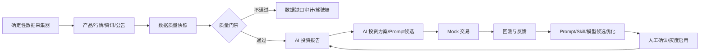

# AI 投资闭环诊断与回正方案

生成时间：2026-06-27  
诊断范围：本地 `dz_database` 真实运行数据、任务定义、闭环步骤、报告质量、核心业务数据表、模型调用链路。

## 结论

项目还有机会回到正轨，也仍然有机会成为一个 AI 驱动、自我成长的投资工作台。

但当前路线必须调整。现在的问题不是单纯“模型不够好”，而是系统把大模型放在了错误的位置：让模型承担实时采集、联网检索、结构化行情/资讯落库这些它并不稳定具备的能力，导致 token 消耗很高，但核心业务数据没有增长。

当前闭环的真实状态是：

- 产品池：`0`
- 行情表：`0`
- 新闻资讯：`0`
- 数据源候选：`334`
- 数据质量快照：`0`
- 投资报告：`7`
- 闭环运行：`31`
- 任务执行：`464`

这说明系统在大量生成“数据源候选”和“失败报告”，而不是在沉淀可投资分析的数据资产。

## 已执行止血

已在本地数据库暂停以下昂贵 AI 定时任务：

- `AI_DATA_SOURCE_DISCOVERY`
- `AI_STRUCTURED_DATA_COLLECTION`
- `AUTO_INVESTMENT_REPORT_GENERATION`
- `AUTO_PROMPT_GOVERNANCE`
- `AUTO_INVESTMENT_CLOSED_LOOP_ORCHESTRATION`

保留手动触发能力。后续验证应通过前端或接口手动触发单个任务，不再让系统自动高频烧模型。

注意：应用内存中的 Cron 调度可能仍保留旧注册。需要重启后端，或通过任务保存接口触发一次 `refreshSchedules()`。

## 关键事实

### 1. 数据源发现成功很多次，但没有产生核心数据

`AI_DATA_SOURCE_DISCOVERY`：

- 成功：`190`
- 失败：`13`
- RUNNING 卡死：`3`
- 平均耗时约 `50.53s`

这些任务主要产出：

- `CNINFO_ANNOUNCEMENT`
- `CSRC_REGULATORY`
- `EASTMONEY_MARKET_FUND_NAV_CN`
- `WIND_AUTH_MARKET_API`
- `SSE_DISCLOSURE_ANNOUNCEMENT`
- 等数据源候选

但它们没有真正把产品、行情、资讯写入：

- `aiw_product = 0`
- `aiw_market_quote = 0`
- `aiw_news_article = 0`

结论：当前模型调用在做“数据源调研”，不是“数据采集”。

### 2. AI 结构化采集明确承认无法联网

`AI_STRUCTURED_DATA_COLLECTION` 被阻断，原因非常关键：

> 当前运行环境未提供联网/实时检索能力，无法访问公开网页或授权数据接口采集最近72小时资讯、公告、研报、监管政策、产品信息或最近2个交易日行情/净值。根据要求，不使用记忆或模拟数据补全，因此 newsArticles、products、quotes 均返回空数组。

这不是模型回答质量差，而是能力边界不匹配。

如果模型没有浏览器、联网检索、授权 API 工具，它不能成为真实采集器。要求它“自己去收集真实数据”，本质上会让它不断消费 token 解释自己做不到，或者生成不可验证的候选。

### 3. 报告失败不是报告模块本身最核心的问题

投资报告已经生成过 `7` 份，但核心数据为空，因此报告质量门禁必然不过。

现在看到的：

- `LOW_DATA_QUALITY`
- `NO_RECENT_NEWS`
- `DATA_GAP_REPORT`
- `没有找到满足质量门禁的最新投资报告`

这些不是坏事。质量门禁在保护系统，防止系统用空数据生成投资建议。

### 4. 定时任务调度过密，且没有成本预算

当前配置中：

- 数据源发现 6 个任务，每 6 小时一轮
- 结构化采集每 2 小时
- 投资报告每 1 小时
- Prompt 治理每 2 小时
- 闭环每 2 小时
- 还有 5 分钟/10 分钟级本地主题扫描

在核心数据为 0 的情况下，报告、Prompt、闭环任务仍继续运行，必然浪费。

更严重的是：当前没有 AI 调用成本表、token 用量表、日预算、任务预算、失败熔断、重复输入缓存。你看到每小时约 2 美金，是系统设计上没有刹车。

## 根因判断

### 不是单纯模型问题

换更强模型可能会让 JSON 更稳定、候选描述更漂亮，但无法解决“没有真实数据入口”的问题。

如果模型没有联网/工具调用/浏览器/API 权限，它不能直接采集实时行情、新闻、公告、净值。

### 是架构职责错位

当前错误分工：

- 大模型负责找数据源
- 大模型负责采集数据
- 大模型负责生成报告
- 大模型负责生成 Prompt
- 大模型负责闭环优化

正确分工应该是：

- 程序采集器负责确定性采集和落库
- 数据质量引擎负责清洗、去重、打分、门禁
- 大模型负责解释、归纳、报告、方案、Prompt 候选、复盘建议
- 人工或灰度开关负责正式启用 Prompt/模型/真实交易

AI 应该增强决策，不应该替代基础数据工程。

### 是业务闭环启动顺序过早

在以下数据没有达标前，不应该自动跑报告和闭环：

- 产品池至少有一组可投资标的
- 每个核心标的有近 2 个交易日行情或净值
- 至少有近 72 小时资讯/公告/监管数据
- 数据质量快照存在并达到阈值

当前系统在 `products=0, quotes=0, news=0` 时仍不断触发 AI 报告和闭环，这是主要浪费来源。

## 是否还有机会

有，而且后端骨架并没有失败。

已经有价值的部分：

- 产品、行情、资讯、质量快照、报告、Prompt、Mock 交易、回测反馈、闭环审计表结构基本齐全
- 质量门禁方向正确
- Mock 交易和复盘链路方向正确
- 模型配置、Skill 绑定、任务配置、前端可配置能力方向正确
- 审计和驾驶舱展示基础已经具备

真正失败的是“把真实数据采集过度交给大模型”这条路线。

回正后，平台可以成为：

> 确定性数据工程 + AI 分析决策 + 可控自动化执行 + 反馈进化 的投资工作台。

而不是：

> 大模型自己凭空找数据、采数据、写报告、做投资。

## 回正总原则

1. 先停高成本自动化，再恢复单任务验证。
2. 先确定性数据采集，再 AI 报告。
3. 先数据质量达标，再闭环交易。
4. 先记录成本，再允许自动运行。
5. 先小范围主题跑通，再扩全市场。

## 整改方案

### 阶段 0：止血与观测

目标：停止无效 token 消耗，建立可观测性。

必须完成：

- 暂停默认 AI 定时任务。
- 清理长期 RUNNING 任务。
- 增加 AI 调用审计表：
  - operationCode
  - modelCode
  - providerCode
  - promptHash
  - systemPromptLength
  - userPromptLength
  - responseLength
  - promptTokens
  - completionTokens
  - totalTokens
  - estimatedCost
  - durationMs
  - status
  - failureReason
  - taskCode
  - runBizId
- 增加预算配置：
  - 每小时预算
  - 每日预算
  - 单任务预算
  - 单闭环预算
  - 连续失败熔断次数
- 模型调用前做预算检查，超过预算直接阻断。

### 阶段 1：重建真实数据入口

目标：不要再让模型直接采集真实数据。

先做 3 类确定性采集器：

1. 行情/净值采集器
   - ETF/基金净值
   - 指数行情
   - 主题标的行情
   - 写入 `aiw_product`、`aiw_market_quote`

2. 资讯/公告采集器
   - 交易所公告
   - 巨潮资讯公告
   - 监管政策
   - 财经新闻 RSS/API
   - 写入 `aiw_news_article`、`aiw_news_target`

3. 质量快照任务
   - 覆盖率
   - 新鲜度
   - 缺失率
   - 去重率
   - 来源可信度
   - 写入 `aiw_data_quality_snapshot`

大模型在这个阶段只做：

- 推荐应该接入哪些 API
- 生成采集字段映射建议
- 总结采集失败原因
- 生成候选配置，不自动启用

### 阶段 2：闭环前置门禁

目标：没数据就不跑 AI，不烧钱。

新增闭环启动前置条件：

- `aiw_product > 0`
- `aiw_market_quote` 近 2 个交易日有数据
- `aiw_news_article` 近 72 小时有数据
- `aiw_data_quality_snapshot` 最新质量分达到阈值

不满足时：

- 不调用报告模型
- 不调用 Prompt 治理模型
- 不调用闭环模型
- 只生成数据缺口审计和前端驾驶舱提示

### 阶段 3：报告模型降本

目标：报告只在数据变化足够大时生成。

需要加入：

- 输入数据 hash
- Prompt hash
- 模型配置 hash
- 最近报告复用机制
- 只有数据增量超过阈值才重新调用模型

报告生成频率建议：

- 默认手动
- 或每日 1 次
- 或数据质量通过且数据变化超过阈值时触发

禁止每小时自动生成报告。

### 阶段 4：Prompt/Skill 进化改为候选制

目标：让 AI 自我成长，但不自我污染。

Prompt/Skill 进化条件：

- 至少有 N 份质量合格报告
- 至少有 N 次 Mock 交易结果
- 至少有 N 次回测反馈
- 成本预算充足

输出必须是：

- 候选 Prompt
- 候选 Skill
- 候选模型参数
- 评分
- 风险说明
- 对比基线

不能自动替换正式版本，只允许前端确认或灰度。

### 阶段 5：恢复自动闭环

恢复顺序：

1. 手动触发确定性采集器。
2. 数据质量快照达标。
3. 手动触发报告。
4. 报告质量达标。
5. 手动触发 Mock 闭环。
6. 连续 3 次成功后，恢复每日低频自动闭环。
7. 连续稳定后，再开放更高频。

## 新默认任务策略

建议默认：

- 数据源发现：关闭定时，只允许手动或每周一次。
- 结构化 AI 采集：关闭定时，不作为主采集链路。
- 确定性行情采集：定时开启。
- 确定性资讯采集：定时开启。
- 数据质量快照：定时开启。
- 报告生成：默认每日一次或手动。
- Prompt 治理：默认关闭，质量样本足够后手动。
- 闭环编排：默认关闭，人工验证通过后每日一次。

## 前端驾驶舱需要展示的新指标

### 成本

- 今日 AI 调用次数
- 今日 token
- 今日费用
- 每小时费用
- 单任务费用排行
- 连续失败烧钱任务
- 预算剩余

### 数据资产

- 产品数
- 行情点数
- 近 2 日行情覆盖率
- 近 72 小时资讯数
- 数据质量分
- 缺口原因

### 闭环

- 当前卡点
- 是否允许报告
- 是否允许 Mock
- 是否允许 Prompt 进化
- 最近成功闭环
- 最近失败原因

## 最重要的产品判断

如果继续坚持“让大模型自己完成真实采集”，项目会继续烧钱但很难稳定。

如果改成“确定性采集器负责数据资产，大模型负责分析、解释、策略、复盘、进化”，项目是可以回到正轨的。

最终形态应该是：

## 下一步建议

优先做三件事：

1. 补 AI 调用成本审计和预算熔断。
2. 把默认任务配置改成低成本、安全模式。
3. 新增第一批确定性真实数据采集器，把 `products/quotes/news` 从 0 变成可用数据资产。

只有这三件事完成后，再恢复自动报告和闭环。
